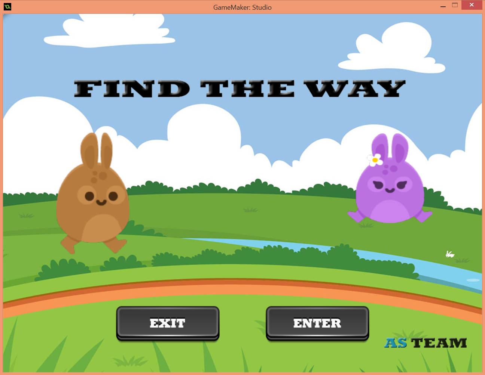
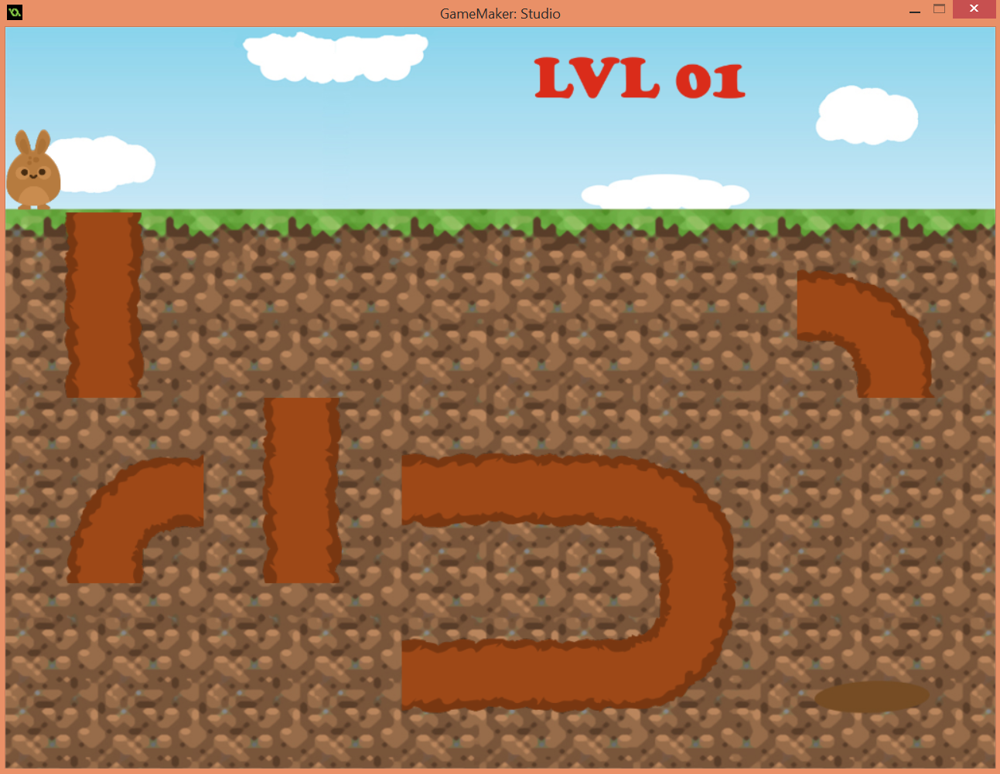

# HamsterGame

Ce petit jeu est le résultat d'une initiation à la programmation des jeux vidéos avec **GML (Game Maker Language)**,
il a était développé par **ASTeam** en trois jours lors du **ZeGaming DevCam**.

Consulter ce [lien](https://www.youtube.com/watch?v=uJ9zYh0P55I&ab_channel=Zegamingteam) pour plus d'inforation sur l'evenement.

